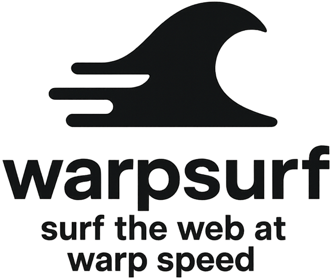
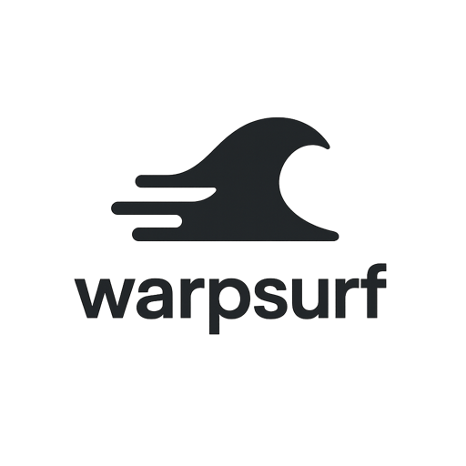
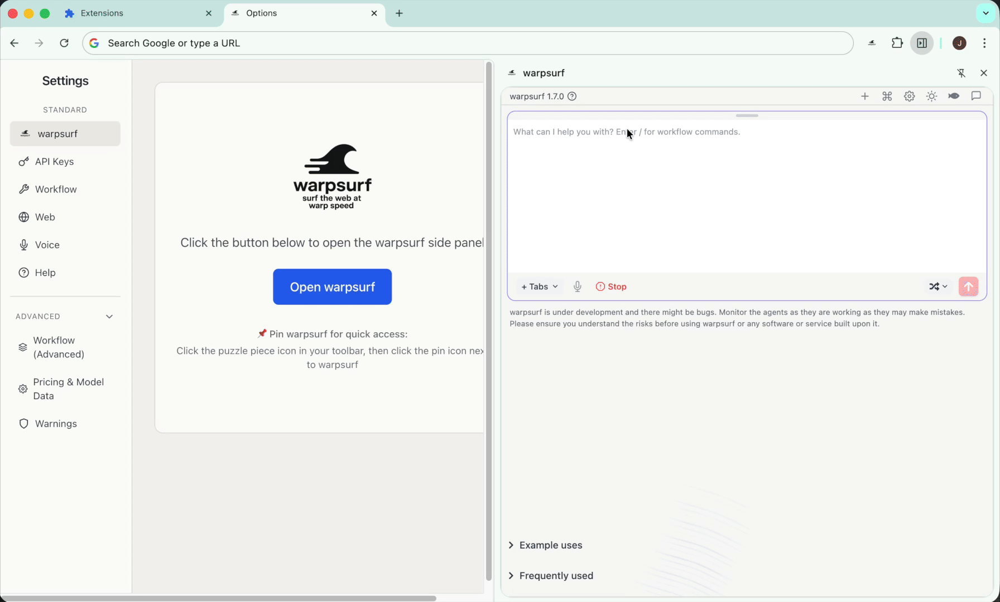
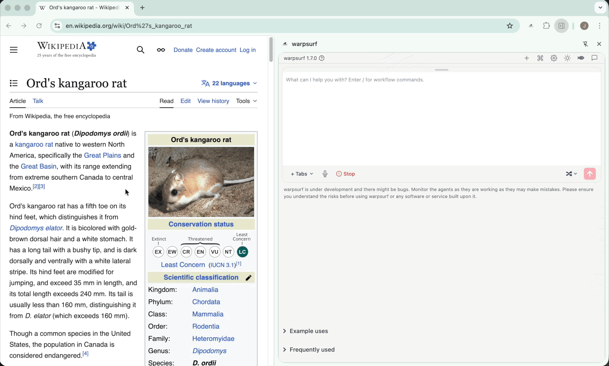
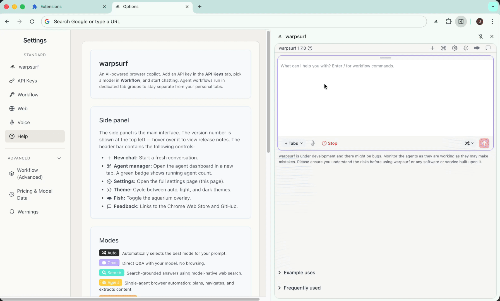
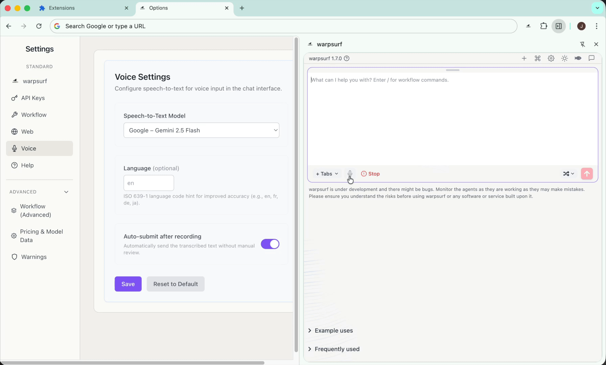

<p align="center">
  
</p>

<p align="center">
  <em><b>Working towards</b> rapid browser automation with an AI copilot that lives in your browser!</em>
</p>

<p align="center">
  <a href="https://chromewebstore.google.com/detail/warpsurf/ekmohjijmhcdpgficcolmennloeljhod"></a>
  <a href="#license"></a>
</p>

---

> [!WARNING]
> 
> **Please carefully read this disclaimer before using warpsurf.**
> 
> Warpsurf is an open source research project under development. This is a community effort to find and fix bugs, and grow the browser automation ecosystem. You should assume there are still vulnerabilities.
> 
> Browser automation represents a new regime of web interaction, with new and unknown risks and challenges. The web is inherently dangerous: your personal details are at risk, scams are prevalent and jailbreaks are not a solved problem. Please monitor the warpsurf agents while they are working as they may make mistakes. Prompt injection and malicious pages may cause unintended actions. Warpsurf might have bugs and security implications. 
> 
> **You should use warpsurf at your own risk.  We accept no liability.**
> 
> We recommend using capped API keys where possible, with spending limits set to an amount you are comfortable losing. Additionally, we assume no liability for the use of any projects derived from this codebase. We encourage open-source innovation but urge cautiousness. 
> 
> **Please ensure you understand the risks before using warpsurf or any software or service built upon it.**


##  What is warpsurf?

**warpsurf** is an AI-powered browser copilot built for speed. Chat, search, and autonomously navigate the web.

## The warpsurf vision


The browser is the door to the Internet. We believe this door should be open and accessible to everyone. Using the web well is increasingly important for work and everyday life. AI-powered browser copilots can make complex, click-heavy workflows easier while keeping your data, sessions, and authentication in your browser. 

For browser automation to be useful, it needs to be fast and enable “warpsurfing” - **warpsurf represents an early step in this direction**. For speed, warpsurf uses intelligent routing and parallel execution. With real-time tab streaming, you can watch agents work and step in at critical moments.

We deliberately design for multi-agent, multi-step LLM usage (assuming intelligence per token will increase and token prices and latency will fall) and we’re building warpsurf as a model-agnostic open-source community tool, open to contributions, critique, and alternative visions. 

As we wait for models to get faster, our goals are to help grow the browser automation ecosystem and find bugs, useful features and use cases. 
~ J O S T

## Demos

All demos are shown in real time.

**Agent** — Using search-urls, warpsurf agents can navigate quickly and efficiently.



**Summarize** — Instantly summarize any page or selected text via a right-click context menu in seconds.



**Tools** — Access built-in tools and settings directly using natural language.



**Voice** — Issue commands and make requests hands-free using voice input with real-time speech-to-text transcription.



## Existing Features

| Feature | Description |
|---------|-------------|
| 🔑 **Model Agnostic** | Just add your own API keys (no extra costs) |
| 🔀 **Router** | Queries are automatically triaged to the right workflow |
| 🧠 **Chat** | Conversational interface powered by leading LLMs |
| 🔍 **Search** | Low latency search-grounded chat |
| 🖱️ **Context Menus** | Right-click to Explain or Summarize selected text or pages |
| 📡 **Streaming** | Real-time streaming responses for Chat and Search workflows |
| 🤖 **Agent** | Navigates and interacts with any webpage |
| 🤖🤖 **Multi-Agent** | Orchestrate multiple agents for complex or parallelisable workflows |
| 📑 **Tab Management** | Agents operate using their own tab groups |
| 🪟 **Tab Context** | Select tabs to add as context in agent workflows |
| 🔒 **Privacy** | Runs locally in your browser; your data stays with you |
| 👁️ **Monitor** | Watch agents work in real-time with tab streaming |
| 📍 **Trajectory View** | Visual timeline of agent actions grouped by site |
| 🔄 **Session Restore** | Workflows persist and resume when the panel is reopened |
| 📈 **Usage Tracking** | Real-time token and cost statistics |
| 💰 **Live Pricing** | Incorporate live pricing data for accurate cost predictions |
| 🎮 **Take Control** | Agent workflows pass control back to you at critical junctures |
| 📜 **History** | Optionally use your browser history to improve performance |
| ⏱️ **Task Estimation** | Preview task duration and cost before initialisation |
| 🎤 **Voice Input** | Make requests via voice using speech-to-text transcription |
| 🛠️ **Conversational Settings** | Configure models, parameters, and tab context through natural language |
| 🗂️ **Agent Manager** | Dashboard to view, search, and manage all agent workflows with live previews |
| 📌 **Auto Tab Context** | Automatically gather open tabs as context with privacy controls |
| 🖼️ **Explain Image** | Right-click any image to get an AI explanation |
| 📎 **Attachments** | Drag-and-drop files and images directly into chat |
| ⭐ **Favorites** | Save, browse, and import favorite prompts |
| 🎨 **Themes** | Switch between dark, light, and auto themes |
| 🛡️ **URL Firewall** | Allow/deny lists to restrict where agents can navigate |
| 🛑 **Emergency Stop** | One-click termination of all running workflows |
| ⏸️ **Pause & Resume** | Pause and resume running agent tasks |
| 💬 **Live Follow-Up** | Send instructions to a running agent without stopping it |
| 🔗 **Workflow Graph** | Visual graph of multi-agent task topology and status |

### Search URLs

Warpsurf agents are encouraged to use a [pattern database](https://github.com/warpsurf/search-urls) to resolve direct search URLs for popular sites, skipping search box interactions and landing on results in a single navigation. This reduces the number of agent actions and improves speed.

## Installation & Usage

warpsurf has only been tested in a Chrome browser.

### Option 1: Chrome Web Store (quick)

1. Visit the [Chrome Web Store](https://chromewebstore.google.com/detail/warpsurf/ekmohjijmhcdpgficcolmennloeljhod)
2. Click **"Add to Chrome"**
3. Pin the extension for easy access

### Option 2: GitHub Release (most recent warpsurf version)

#### Download
Download the `vX.Y.Z.zip` file from the latest warpsurf [GitHub release](https://github.com/warpsurf/warpsurf/releases).

#### Install
1. Unzip `vX.Y.Z.zip`.
2. Navigate to chrome://extensions
3. Enable "Developer mode"
4. Click "Load unpacked"
5. Select the unzipped folder folder

#### Updates
1. Repeat the Download and Installation instructions.
2. At chrome://extensions, click 'Update' and click the refresh icon on the warpsurf listing.

### Option 3: Manual GitHub Installation (most recent codebase)

```bash
# Clone this repository
git clone https://github.com/warpsurf/warpsurf.git
cd warpsurf

# Install dependencies
pnpm install

# Build the extension (this creates a dist dir)
pnpm build:store

## In Chrome browser:
# 1. Navigate to chrome://extensions
# 2. Enable "Developer mode"
# 3. Click "Load unpacked"
# 4. Select the dist folder
```

### Usage

Follow instruction in the extension to add API keys and select models. Then, you're ready!

### Model Compatibility

Warpsurf is compatible with leading LLM providers:

OpenAI, Anthropic, Google, xAI, OpenRouter, All OpenAI-compatible APIs

### Complimentary chrome extensions

Adding chrome extensions that reduce popups (ads, CAPTCHAs, cookie banners) can improve the performance of warpsurf agents. These are some available from the chrome store:
- [Ad Blocker](https://chromewebstore.google.com/detail/ad-blocker-stands-adblock/lgblnfidahcdcjddiepkckcfdhpknnjh)


## Contributing

We welcome contributions, especially bug fixes, security concerns, feature requests and interesting use cases.

## License

This project is licensed under the Apache License 2.0—see the [LICENSE](LICENSE) file for details.

If you find warpsurf useful, please consider giving it a star! It might help others discover the project.

## Acknowledgements

We thank the creators and maintainers of the [browser-use](https://github.com/browser-use/browser-use) and [nanobrowser](https://github.com/nanobrowser/nanobrowser) repositories, which this work is built on and inspired by.

---

<p align="center">
  <strong>Released for the open source community</strong>
</p>

<p align="center">
  <a href="#disclaimer">Disclaimer</a> •
  <a href="#installation">Get Started</a> •
  <a href="#existing-features">Features</a> •
  <a href="#contributing">Contribute</a>

</p>
